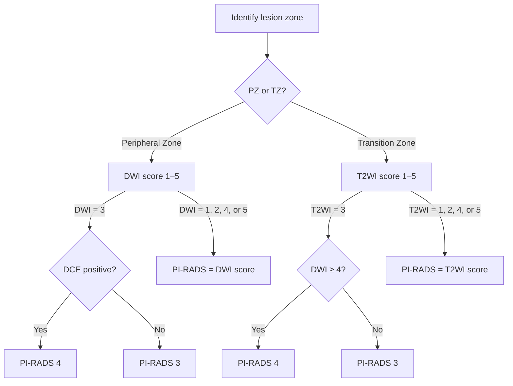

# PI-RADS v2.1 — Prostate MRI Reporting & Data System

??? info "Reference Information"
    **Full Name:** Prostate Imaging Reporting and Data System
    **Version:** 2.1 (2019)
    **Publisher:** American College of Radiology (ACR) / European Society of Urogenital Radiology (ESUR)
    **Application:** Multiparametric MRI (mpMRI) of the prostate
    **Last Institutional Review:** January 2024
    **Modifications:** None

!!! info "Purpose"
    PI-RADS v2.1 standardizes mpMRI assessment for clinically significant prostate cancer (csPCa), defined as Gleason score ≥ 7 (Grade Group ≥ 2) or tumor volume ≥ 0.5 cc.

---

## PI-RADS Calculator

  <form id="pirads-form">
    

      <label for="calc-zone">Lesion Zone</label>
      <select id="calc-zone" required>
        <option value="peripheral">Peripheral Zone (PZ) — DWI dominant</option>
        <option value="transition">Transition Zone (TZ) — T2WI dominant</option>
      </select>
    

    

      <label for="calc-dwi_score">DWI Score (1–5) <small>— Primary for PZ; secondary for TZ</small></label>
      <select id="calc-dwi_score" required>
        <option value="1">1 — No abnormality</option>
        <option value="2">2 — Indistinct hypointensity on ADC</option>
        <option value="3">3 — Focal mild/moderate hypointensity; &lt;1.5 cm</option>
        <option value="4">4 — Focal marked hypointensity; &lt;1.5 cm</option>
        <option value="5">5 — As 4 but ≥1.5 cm or definite EPE</option>
      </select>
    

    

      <label for="calc-t2wi_score">T2WI Score (1–5) <small>— Primary for TZ; not used for PZ scoring</small></label>
      <select id="calc-t2wi_score" required>
        <option value="1">1 — Normal TZ or round well-defined BPH nodule</option>
        <option value="2">2 — Circumscribed hypointense, well-defined margins</option>
        <option value="3">3 — Heterogeneous, obscured margins</option>
        <option value="4">4 — Lenticular/non-circumscribed homogeneous; &lt;1.5 cm</option>
        <option value="5">5 — As 4 but ≥1.5 cm or definite EPE</option>
      </select>
    

    

      <label for="calc-dce_positive">DCE Positive? <small>— PZ only: focal early enhancement vs. adjacent tissue</small></label>
      <select id="calc-dce_positive" required>
        <option value="no">No (or not applicable)</option>
        <option value="yes">Yes — Focal early enhancement</option>
      </select>
    

    <button type="submit" id="pirads-form-btn" class="calc-btn">Calculate PI-RADS</button>
  </form>

---

???+ abstract "PI-RADS Quick Reference"
    | Score | Probability of csPCa | Action |
    |-------|----------------------|--------|
    | **PI-RADS 1** | Very low (essentially no csPCa) | No biopsy |
    | **PI-RADS 2** | Low | No biopsy (consider in context) |
    | **PI-RADS 3** | Intermediate | Biopsy at clinician discretion (consider PSA density, clinical risk) |
    | **PI-RADS 4** | High | Targeted biopsy recommended |
    | **PI-RADS 5** | Very high | Targeted biopsy strongly recommended |

---

## MRI Sequences and Dominant Sequence by Zone

!!! info "Dominant Sequence by Zone"

    | Zone | Dominant Sequence | Secondary Sequence |
    |------|-----------------|-------------------|
    | **Peripheral Zone (PZ)** | DWI (Diffusion-Weighted Imaging) | DCE (Dynamic Contrast Enhancement) |
    | **Transition Zone (TZ)** | T2WI (T2-Weighted Imaging) | DWI |
    | **Central Zone** | Assessed as part of TZ | — |

---

## Peripheral Zone (PZ) — DWI Dominant

=== "DWI Scores (PZ)"

    | DWI Score | Description |
    |-----------|-------------|
    | **1** | No abnormality (homogeneous hyperintense on ADC and iso/hyperintense on high b-value DWI) |
    | **2** | Indistinct hypointense on ADC |
    | **3** | Focal mildly/moderately hypointense on ADC and iso/mildly hyperintense on high b-value DWI; <1.5 cm |
    | **4** | Focal markedly hypointense on ADC and markedly hyperintense on high b-value DWI; <1.5 cm |
    | **5** | As per 4 but ≥1.5 cm, or definite extraprostatic extension/invasive behavior |

=== "DCE Role (PZ)"

    DCE is used as a **secondary** sequence in the PZ:

    - **DCE positive:** Focal early enhancement (earlier than or simultaneously with adjacent normal tissue), used to **upgrade** DWI score 3 → PI-RADS 4
    - **DCE negative:** Does not change the DWI assessment

    !!! tip "DCE Upgrade Rule"
        PZ DWI 3 + DCE positive → **PI-RADS 4**
        PZ DWI 3 + DCE negative → **PI-RADS 3**

---

## Transition Zone (TZ) — T2WI Dominant

=== "T2WI Scores (TZ)"

    | T2WI Score | Description |
    |------------|-------------|
    | **1** | Normal-appearing TZ (homogeneous intermediate signal); or round/well-defined hypointense nodule (BPH nodule) |
    | **2** | Circumscribed hypointense or heterogeneous signal intensity but well-defined margins |
    | **3** | Heterogeneous signal intensity with obscured margins (includes others not qualifying as 2, 4, or 5) |
    | **4** | Lenticular or non-circumscribed, homogeneous, moderately hypointense; <1.5 cm |
    | **5** | As per 4 but ≥1.5 cm, or definite extraprostatic extension/invasive behavior |

=== "DWI Role (TZ)"

    DWI is used as a **secondary** sequence in the TZ:

    - **DWI 4 or 5:** Upgrade T2WI 3 → PI-RADS 4
    - **DWI 1, 2, or 3:** Does not change T2WI assessment

    !!! tip "DWI Upgrade Rule"
        TZ T2WI 3 + DWI ≥4 → **PI-RADS 4**
        TZ T2WI 3 + DWI ≤3 → **PI-RADS 3**

---

## Overall PI-RADS Score Assignment

---

## Anatomic Zones of the Prostate

| Zone | Location | Proportion of Gland | Cancer Origin |
|------|----------|---------------------|---------------|
| **Peripheral Zone (PZ)** | Posterior/lateral, base to apex | ~70% | ~70% of PCa |
| **Transition Zone (TZ)** | Surrounding urethra, central gland | ~20–30% | ~20–30% of PCa |
| **Central Zone (CZ)** | Surrounding ejaculatory ducts at base | ~5% | Rare |
| **Anterior Fibromuscular Stroma (AFMS)** | Anterior | N/A | Rare |

---

## Extraprostatic Extension (EPE) Assessment

!!! warning "Extraprostatic Extension Indicators"

    | Feature | Significance |
    |---------|-------------|
    | Capsular bulge or irregularity | Suspicious for EPE |
    | Broad capsular contact (≥1 cm) | Higher EPE risk |
    | Obliteration of rectoprostatic angle | Suspicious for EPE |
    | Neurovascular bundle asymmetry | Suspicious for involvement |
    | Tumor abutting seminal vesicle | Seminal vesicle invasion risk |

    !!! danger "Seminal Vesicle Invasion (SVI)"
        Low T2/ADC signal within seminal vesicle + direct extension from primary tumor = **SVI** (T3b disease)

---

## PSA Density (PSAD)

$$\text{PSAD} = \frac{\text{PSA (ng/mL)}}{\text{Prostate Volume (cc)}}$$

| PSAD | Interpretation |
|------|----------------|
| <0.10 | Low risk; biopsy may be deferred in PI-RADS 3 |
| 0.10–0.15 | Intermediate; shared decision-making for PI-RADS 3 |
| ≥0.15 | Higher risk; supports biopsy recommendation for PI-RADS 3 |

!!! tip "Prostate Volume Measurement"
    Use ellipsoid formula: **V = 0.52 × AP × TR × CC** (all in cm)

### PSA Density Calculator

  <form id="psa-density-form">
    

      <label for="calc-psa">PSA (ng/mL)</label>
      <input type="number" id="calc-psa" step="0.01" min="0" required placeholder="e.g., 5.2">
    

    

      <label for="calc-prostate_volume_cc">Prostate Volume (cc) <small>— V = 0.52 × AP × TR × CC</small></label>
      <input type="number" id="calc-prostate_volume_cc" step="0.1" min="0" required placeholder="e.g., 35.0">
    

    <button type="submit" id="psa-density-form-btn" class="calc-btn">Calculate PSA Density</button>
  </form>

---

## Technical Requirements for mpMRI

=== "Minimum Standards"

    | Sequence | Requirement |
    |----------|-------------|
    | **T2WI** | ≥3 planes; slice thickness ≤3 mm; in-plane resolution ≤0.7 mm |
    | **DWI** | Include b = 0 and b ≥ 800 s/mm²; calculate ADC map; optional high b-value (b ≥ 1400 s/mm²) |
    | **DCE** | Temporal resolution ≤15 sec; spatial coverage of entire prostate |

=== "Field Strength"

    - **3T preferred** — higher SNR and spatial resolution
    - **1.5T acceptable** — endorectal coil may improve quality
    - Endorectal coil not required at 3T with modern phased-array surface coils

---

## Reporting Template Elements

!!! info "Required Report Elements"
    1. **Technique:** Field strength, coil type, sequences performed
    2. **Prostate:** Volume, PSA density (if PSA available), overall gland appearance
    3. **Lesion description** (for each PI-RADS ≥ 3):
        - Location (zone, sector per 27-sector map)
        - Size (cm)
        - DWI score, T2WI score, DCE result
        - Overall PI-RADS score
        - EPE suspicion
    4. **Lymph nodes:** Regional nodal assessment
    5. **Seminal vesicles**
    6. **Incidental findings**
    7. **Overall impression:** Most significant PI-RADS score; clinical management recommendation

---

## Prostate Sector Map (27-Sector)

??? tip "Zone Sectors for Localization"

    **Peripheral Zone (18 sectors):**
    - Right/Left × Base/Mid/Apex × Anterior/Posterior/Lateral

    **Transition Zone (4 sectors):**
    - Right/Left × Base/Mid

    **Anterior Fibromuscular Stroma (1 sector)**

    **Seminal Vesicles (2 sectors, not numbered)**

    !!! note
        Use standardized sector map in reports and communicate sector to urology for targeted biopsy planning.

---

## Common Pitfalls

!!! warning "Avoid These Mistakes"

    **❌ Don't:**

    - Assign PI-RADS based on a single sequence — integrate all sequences
    - Ignore the distinction between PZ and TZ (each has a different dominant sequence)
    - Overcall BPH nodules in TZ as PI-RADS 4/5 — BPH has characteristic encapsulated, heterogeneous appearance
    - Overlook anterior TZ tumors — they can be subtle on DWI
    - Forget EPE assessment for PI-RADS ≥ 4 lesions

    **✅ Do:**

    - Measure prostate volume and calculate PSAD when PSA is available
    - Report sector location for targeted biopsy planning
    - Note prior treatment (radiation, HIFU, focal ablation) — may alter assessment
    - Compare to any prior MRI

---

## Version History

| Date | Version | Changes |
|------|---------|---------|
| 2024-01-15 | Internal | Initial implementation at institution |
| 2019 | v2.1 | Updated DWI scoring and DCE role; replaced v2.0 |
| 2015 | v2.0 | Major revision from v1.0 |

---

## References

1. American College of Radiology / European Society of Urogenital Radiology. PI-RADS™ Prostate Imaging – Reporting and Data System, Version 2.1. 2019.
2. Turkbey B, Rosenkrantz AB, Haider MA, et al. Prostate Imaging Reporting and Data System Version 2.1: 2019 Update of Prostate Imaging Reporting and Data System Version 2. Eur Urol. 2019;76(3):340-351.
3. Weinreb JC, Barentsz JO, Choyke PL, et al. PI-RADS Prostate Imaging – Reporting and Data System: 2015, Version 2. Eur Urol. 2016;69(1):16-40.

---

*Last updated: 2024-01-15 | Maintained by: Radiology QI Committee | Contact: radiology_qi@institution.edu*
